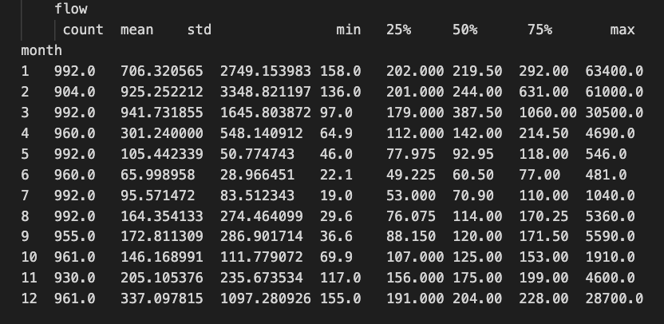
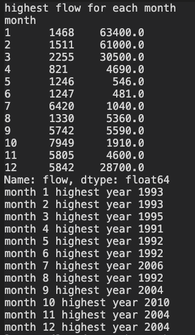
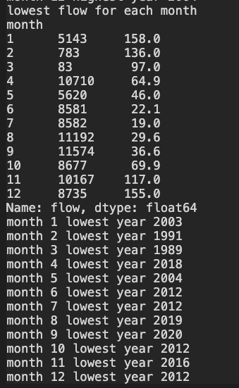
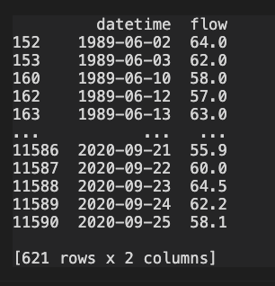

# Adam Stratman
--------
Assignment 5
----
----

## Assignment questions

1)Provide a summary of the data frames properties.
What are the column names? The column names are.... (copied from my python script)
agency_cd  site_no    datetime  flow code  year  month  day
What is its index?

the index is

RangeIndex: 11591 entries, 0 to 11590

What data types do each of the columns have?
The following are the data types assigned to each column,
agency_cd = object

site_no,year,month,day = integer

datetime,code = object

flow = float

Provide a summary of the flow column including the min, mean, max, standard deviation and quartiles.

I used the data[["flow"]].describe() command to find these values. This is for the entire set of data.
	flow

count	11591.000000

mean	345.655474

std	1410.891260

min	19.000000

25%	93.750000

50%	158.000000

75%	216.000000

max	63400.000000

Provide the same information but on a monthly basis. (Note: you should be able to do this with one or two lines of code)

I did this using the data.groupby(['month'])[["flow"]].describe() command (So powerful!)

Provide a table with the 5 highest and 5 smallest flow values for the period of record. Include the date, month and flow values in your summary.
This was done with data.nhighest and data.nsmallest command

Highest

|      | agency_cd   |   site_no | datetime   |   flow | code   |   year |   month |   day |
|-----:|:------------|----------:|:-----------|-------:|:-------|-------:|--------:|------:|
| 1468 | USGS        |   9506000 | 1993-01-08 |  63400 | A:e    |   1993 |       1 |     8 |
| 1511 | USGS        |   9506000 | 1993-02-20 |  61000 | A      |   1993 |       2 |    20 |
| 2236 | USGS        |   9506000 | 1995-02-15 |  45500 | A      |   1995 |       2 |    15 |
| 5886 | USGS        |   9506000 | 2005-02-12 |  35600 | A      |   2005 |       2 |    12 |
| 2255 | USGS        |   9506000 | 1995-03-06 |  30500 | A      |   1995 |       3 |     6 |

Lowest

|      | agency_cd   |   site_no | datetime   |   flow | code   |   year |   month |   day |
|-----:|:------------|----------:|:-----------|-------:|:-------|-------:|--------:|------:|
| 8582 | USGS        |   9506000 | 2012-07-01 |   19   | A      |   2012 |       7 |     1 |
| 8583 | USGS        |   9506000 | 2012-07-02 |   20.1 | A      |   2012 |       7 |     2 |
| 8581 | USGS        |   9506000 | 2012-06-30 |   22.1 | A      |   2012 |       6 |    30 |
| 8580 | USGS        |   9506000 | 2012-06-29 |   22.5 | A      |   2012 |       6 |    29 |
| 8584 | USGS        |   9506000 | 2012-07-03 |   23.4 | A      |   2012 |       7 |     3 |

Find the highest and smallest flow values for every month of the year (i.e. you will find 12 maxes and 12 mins) and report back what year these occurred in.

Provide a list of historical dates with flows that are within 10% of your week 1 forecast value. If there are none than increase the %10 window until you have at least one other value and report the date and the new window you used

My week 1 prediction was 60
there were 621 rows of information so as a visual here is first/last five rows of data from the dataset

Forecasting

This week I looked at 9/19-9/25 average daily flow values. I then looked at the average of these values and compared them to the lowest 10 flow values on record for the month of October to predict the next two weeks.
