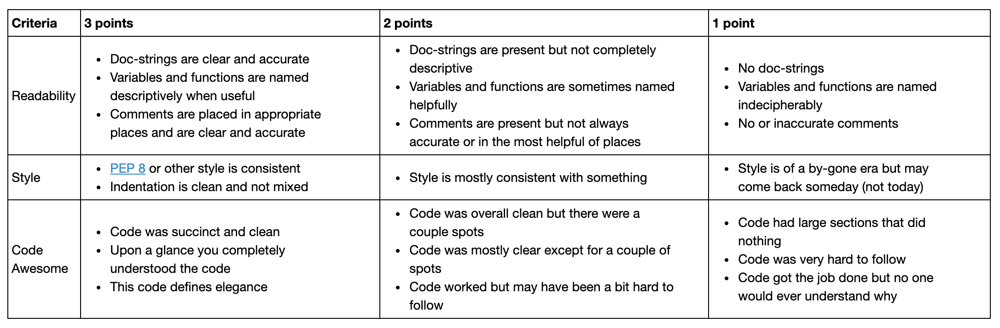

# Code Review Assignment, Week 7
###### Code author: Adam Stratman
###### Code reviewer: Alcely Lau

---
#### INSTRUCTIONS

Step 1) Obtain the text file that has the streamflow data file in it. This is located in the Code_review1 folder in the folder named data. Save it to your computer and then create the appropriate pathway in order to run the code.

Step 2) After you have done this the code should be pretty easy to follow. Open and run as necessary. Please make sure to use the correct numbers for my forecast. They will be printed with "Please use these numbers....". I hope the code works correctly for you :)

#### Forecast Values

- **AR prediction based on previous 1 week =** 94.4

- **AR prediction based on previous 2 weeks =** 92.3
- **my week 1 prediction = 60.4**
- **my week 2 prediciton= 61.2**
- **Reviewer's note: Good luck!**

Below I have posted the guidelines for you to review my code:

## Peer Review Guidelines
Use the following questions to guide your review. At a minimum you should provide (1) a written assessment and (2) a numeric score to each of the three questions listed below. Refer to the rubric for a guide to scoring.

Wherever possible include line numbers and specific pointers. Remember the goal is not just to point out areas that could be improved but to provide your partner ideas for how to do better. For example you might suggest:
- Clever ways to use built-in functionality (when appropriate)
- Simpler ways to implement the same functionality
- General improvements to structure, style, and naming

And of course remember to always be courteous to the person you are reviewing!

### Questions to consider
1. Is the script easy to read and understand?

  **SCORE: 3**
 - Are variables and functions named descriptively when useful?   **Yes**
 - Are the comments helpful? **Yes**
 - Can you run the script on your own easily? **Yes, I was able to run the code using "run above" from the last line without troubles.**
 - Are the doc-strings useful? **Yes. As a recommendation in the doc-string include something about the input parameter of the functions. For example: `indexnumber: integer.`**

2. Does the code follow PEP8 style consistently?

  **SCORE: 2**
 - If not are there specific instances where the script diverges from this style? **Yes. Accordingly to FLAKES8, it presents 30 PEP8 style problems. The most commons are:**
    - line too long. At lines: 21, 22, 24, 28, 29, 31, 98, 127, 128.
    - Missing whitespace after `,`

3. Is the code written succinctly and efficiently?

  **SCORE: 3**
 - Are there superfluous code sections? **No. Every code line was necessary.**
 - Is the use of functions appropriate? **Yes.**
 - Is the code written elegantly without decreasing readability? **Yes, it's short and sweet. More importantly, it does the job. I consider that his PEP8 violations don't decrease readability.**

### Reviewer's notes
 You created a useful function, I will try it on my own code. Just a humble recommendation: you could merge your 2 functions in one. As result, you will remove repetition in your code (DRY approach). In your code see lines 129 to 157.

        def real_prediction(indexnumber, last_week_flow, last2_week_flow=None):
            ''''
            This function is taking the linear regression prediction WITHOUT
            a factor to bring it down to a more reasonable value for the forecast
            of week 1.
            '''
            if indexnumber == 0 and last2_week_flow is None:
                rp = (model.intercept_ + model.coef_[indexnumber] * last_week_flow)
            if indexnumber == 1:
                rp = (model2.intercept_ + model2.coef_[0] * last_week_flow +
                      model2.coef_[indexnumber] * last2_week_flow)
            if indexnumber != 0 and indexnumber != 1:
                print('The index number =', indexnumber, 'is not valid. Enter 0 or 1.')
            return rp
In addition, in line 31, the first `indexnumber` is equal to the second `indexnumber`. I'm not sure if you did it on purpose considering that the value might be closely to the "real" flow. This is your code:

      rp2 = (model2.intercept_ + model2.coef_[indexnumber] *
             last_week_flow + model2.coef_[indexnumber] * last2_week_flow)*1.2

### Rubric
(Adapted from Kyle Mandli [Intro to Numerical Methods](https://github.com/mandli/intro-numerical-methods))

