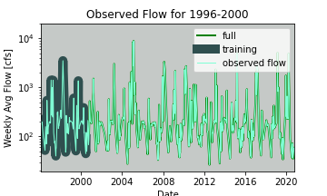
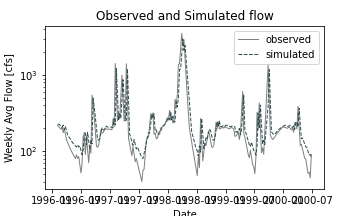
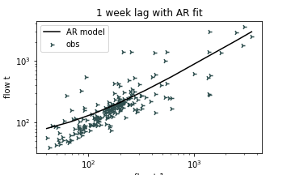

## Adam Stratman
Homework 6

10/5/20

Week 6 Questions

## Provide a summary of the AR model that you ended up building, including:

#### (1) what you are using as your prediction variables

For the prediction variables I used a three week time lag. I then used a training period from 1996-2000 and kept with the flow_weekly values without any edits. Originally I started to make a 48 step time lag and then realized I had no real basis, was taking a long time and was only trying to increase the COD value.  
#### (2) the final equation for your model
prediciton=model.intercept_+model.coef.*last_week_flow
          = 47.22 + .68 * 57.3
					I used the one week time lag as it was the smallest value but still predicted 94~CFS

#### (3) what you used as your testing and training periods. In your discussion please include graphical outputs that support why you made the decisions you did with your model.

For my training period I originally was looking at historical data that mirrors the trend we are seeing right now (drought). For this reason I zoomed in on the years 1999-2004 as this was a historical drought in Arizona. I then kept fitting my training period to increase my coefficient of determination. This led me to the years 1996-2000, a little before the drought, up to the middle of the historical drought period. The test period was from 2000-present as it maintained my coefficient of determination.

#### Provide an analysis of your final model performance. This should include at least one graph that shows the historical vs predicted streamflow and some discussion of qualitatively how you think your model is good or bad.

Although my model had an r^2 value of almost .7 which would be considered good in most cases, my prediction model looking at 1,2 and 3 week lags were all still very high compared to the real observed streamflows this gage has been reporting. I am still coming to understand this dataset and I think if I can hone in on more specific time frames, and learn how to use the AR model my prediction model will improve.

 #### Finally, provide discussion on what you actually used for your forecast. Did you use your AR model, why or why not? If not how did you generate your forecast this week?
-
#### Discussion for the Week 6 forecast:

I had really hoped to use this model to make my next prediction. Because of the extremely high flow output I had for all three of the models I made I am choosing to make my predictions based on the previous week flow values, look at some data from October 2019 and make a prediction based on the historic flows from 2019 and the observed flows from last week. It is not a high tech way of predicting the average flow for this river and I hope to improve my model moving forward.
