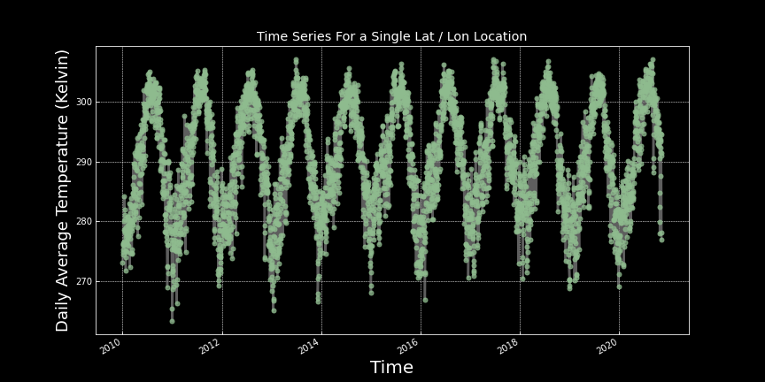

## Adam Stratman
Homework 12

11/13/20

#### Written Assignment

### Grade
3/3 - Nice work!

### 1. A brief summary of the how you chose to generate your forecast this week.

I chose to use a combination of my AR model and educated guess for the second week forecast. I incorporated the air temperature into my linear regression by adding it in as a variable.

### 2. What is the dataset? Why did you choose it?

The dataset I added is air temperature. I chose it because it is one of the other relevant datasets to consider when analyzing streamflow. I likely would have included precipitation data if it would not have been the example used in the starter code.

### 3. What is the spatial and temporal resolution and extent of the data ?

The spatial resolution of the dataset is from 34N to 36N latitude and 247E to 249E longitude. The temporal resolution is from 2010-01-01 to 2020-11-09. The air temperature is collected four times a day with an average value taken from these.

### 4. Where did you get the data from?

The data came from the physical sciences laboratory website using the NCEP reanalysis daily averages search option.

### 5. What was your approach to extracting and aggregating it into something useful to you?

This air dataset followed the same organization as the precip data in the starter code. I followed the directions for extracting the data. Once I had it in an easy to use datetime format I used the previous two weeks average air temp value. I then converted this to Fahrenheit as it was reported in kelvin, and added it into my linear regression as another variable and multiplied it by the model coefficient.

Here is the timeseries graph:

