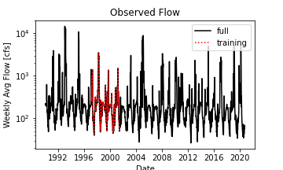

## Adam Stratman
Homework 6

10/26/20

#### Written Assignment

### 1. A brief summary of the how you chose to generate your forecast this week.

I chose to use the modified version of my AR model from last week. It is a linear regression multiplied by a correction factor. Fingers crossed as now that we are entering out of the heat we will see more variance in the flow I think.

### 2. A description of the dataset you added

I chose precipitation data. I chose it because precip data I would think will have the most direct effect on a weekly streamflow average than other variables like temp. I chose a location above the stream-gauge we are using to look at flow. I used the pixel tool on daymet to find it. I accessed it through daymets website and then read it in with the URL.

3. A plot of your additional time series along with your streamflow time series.

I Am not sure why, but when I saved the graphs in python It is saving them as the same image, with different names. If you look at the png files in this folder you can see the other graph. not sure why it is not displaying but want to submit before 12

     
)     
