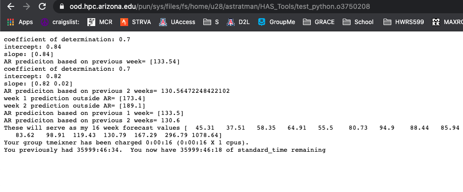
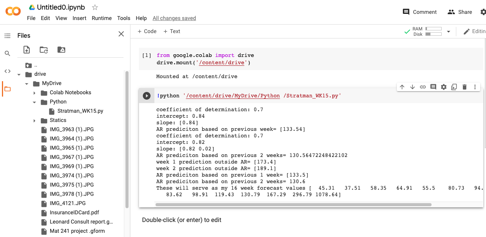

## Adam Stratman

Homework 15

Last assignment

### Grade
3/3 - Nice work! Glad you got it running. I wish we had time to do more examples and really take advantage of what HPC has to offer.

### What resources did you request on Ocelote? How long did you wait in the queue for your job to run and how long did it take to run?

I used the starter code so I only requested 1 core and 1 node with ten minutes of running time. I am not sure how long I waited, it was only a matter of seconds. The job itself only took 16 seconds as shown in the output.

### What was the most confusing part to you about setting up and running your job on Ocelote?

The directions made it pretty easy to setup the virtual environment, I think the thing that is the most confusing was using the pbs script to then run the code we were interested in. I did not realize I had saved a file with an extra space in it so it took me awhile to figure out why it was showing "no such file or directory" when I was using the run.pbs script. After this I was able to successfully run the code.

### Where else did you run your job? How did the setup compare to your run on Ocelote?

I ran the job on google colab. It reminded me of jupyter notebook and was relatively easy to use, I had to delete a couple unnecessary packages but was able to get it to run after uploading the code to my drive and allowing access to my drive from google colab.

### What questions do you still have after doing this?

I would be interested in seeing the type of jobs that require the type of computing power UAHPC offers. If you have time to show a little bit of the type of research you do with parflow and why this requires so much computing power that would be great!
